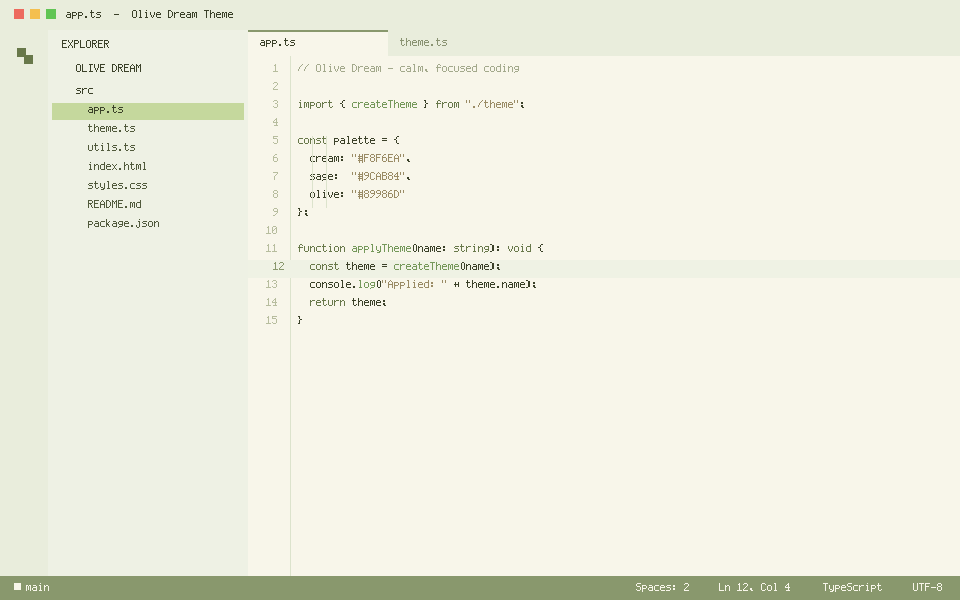
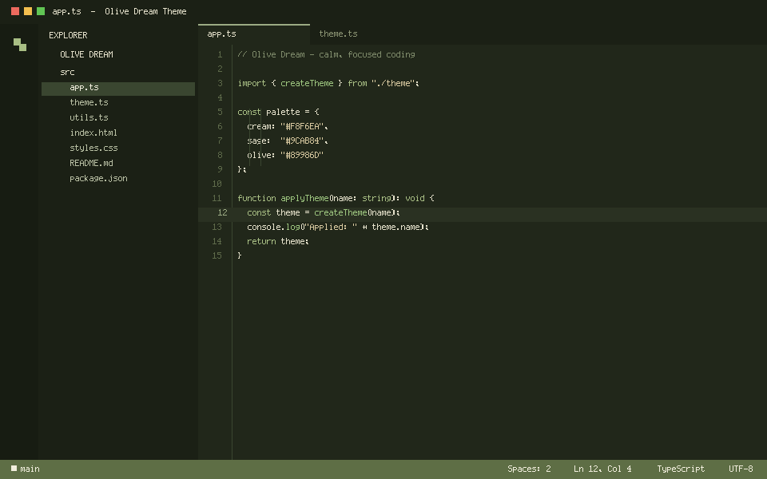

# Olive Dream Theme

> A calm, natural, premium sage‑green Visual Studio Code theme for creative developers, AI builders and designers.

Olive Dream is inspired by nature, slow living and cozy creative workspaces. It pairs a soft cream‑green editor surface with muted olive and sage accents, giving you a **calm, focused, creative and comfortable** coding experience — without the harsh pure‑white backgrounds or loud, high‑saturation greens.

---

## Preview

### Light

### Dark

---

## Features

- **Two calm variants** — **Olive Dream** (soft light) and **Olive Dream Dark** (deep olive‑charcoal), sharing the same natural sage/olive palette.
- **Soft cream‑green editor** (`#F8F6EA`) — easy on the eyes during long sessions, never pure white.
- **Cohesive natural palette** — sage, olive and cream across the entire workbench (Activity Bar, Side Bar, Panel, Status Bar).
- **Calm syntax highlighting** tuned for readability:
  - Keywords → deep olive `#68784A`
  - Functions → soft forest green `#75985A`
  - Strings → natural warm `#9A8B65`
  - Numbers → warm gold `#C49A4A`
  - Comments → low‑contrast grey‑green `#A3A98C`
- **Semantic highlighting** enabled for JavaScript, TypeScript and Python accuracy.
- **Tuned terminal colors** that stay in the same natural family.
- **Minimal, modern SaaS‑style UI** — rounded, clean, designer‑friendly.
- **Optimized for:** JavaScript · TypeScript · React · HTML · CSS · JSON · Python.

---

## Installation

📦 **Marketplace:** [Olive Dream Theme](https://marketplace.visualstudio.com/items?itemName=lilinhuang.olive-dream-theme)

### From the VS Code Marketplace
1. Open **Extensions** (`Ctrl/Cmd + Shift + X`).
2. Search for **Olive Dream Theme**.
3. Click **Install**.

### From VS Code
1. Open the Command Palette (`Ctrl/Cmd + Shift + P`).
2. Run **Preferences: Color Theme**.
3. Select **Olive Dream**.

---

## Recommended pairing
For the full Olive Dream experience, pair with a soft UI font (e.g. *Cascadia Code*, *JetBrains Mono* or *Fira Code*) and enable font ligatures.

---

## Marketplace description

> **Olive Dream Theme** — a calm, natural, premium sage‑green theme for VS Code, available in **Light** and **Dark** variants.
> Designed for creative developers, AI builders and designers who want a quiet, focused and comfortable coding environment. Soft cream‑green editor (or deep olive‑charcoal in Dark), muted olive accents, and carefully tuned syntax colors for JS, TS, React, HTML, CSS, JSON and Python.

---

## Feedback & contributions

Issues and pull requests are welcome at the [GitHub repository](https://github.com/vaxicy/olive-dream-theme).

---

## License

Non‑Commercial License. See [LICENSE.md](./LICENSE.md) for details.
